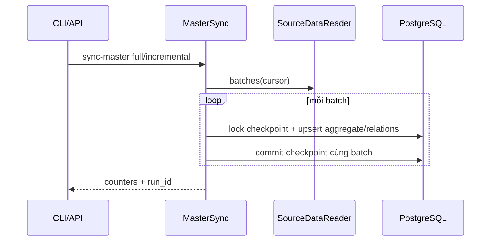
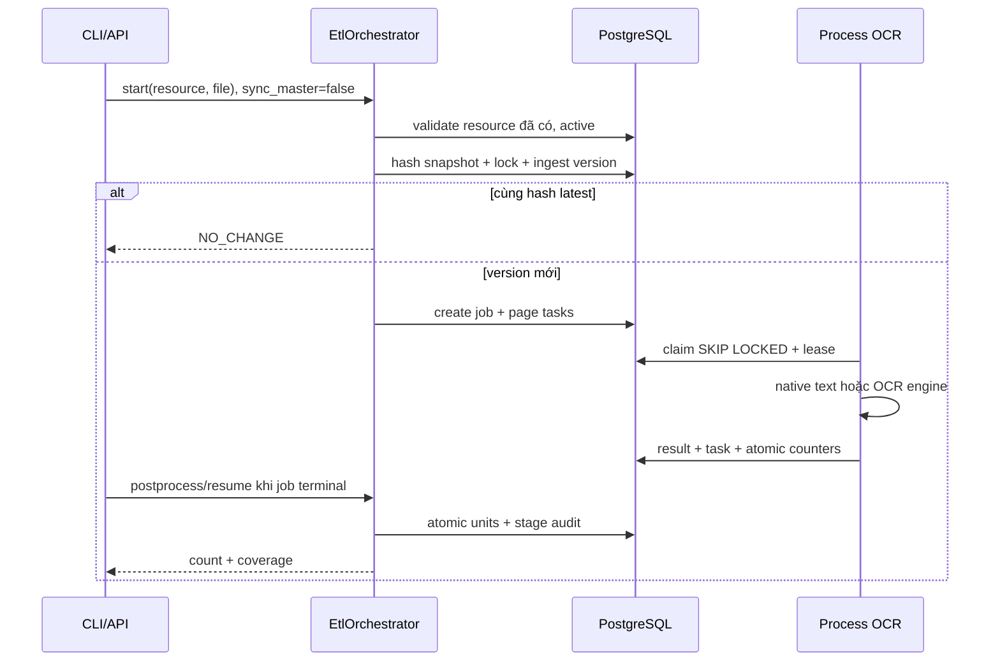

# Master Sync và Resource ETL là hai workflow độc lập

`start(..., sync_master=False)` không gọi sync. Convenience `sync_master=True` vẫn được giữ nhưng chỉ
incremental all streams, không tự full sync hay giả lập sync một resource. Ingestion guard từ chối master
thiếu/inactive/deleted. API ingest vốn gọi ResourceIngestion trực tiếp, không thay đổi contract.

Demo CLI explicit full sync khi fixture resource chưa có; lần sau không seed lại.
CLI là công cụ orchestration local; API không chạy worker loop. Sau crash giữa ingest/job creation,
gọi create-ocr-job hoặc resume-etl bằng version ID. Sau crash worker: recover-stale rồi chạy worker.
Postprocess rerun idempotent, rollback giữ units cũ. Audit RUNNING cũ có thể còn nếu process chết.

`etl-status` trả resource/version/latest version, job/counters, tối đa 20 stage gần nhất và content count;
không trả users/password/OCR text. Correlation ID theo invocation, nối process qua version/job/task IDs.
