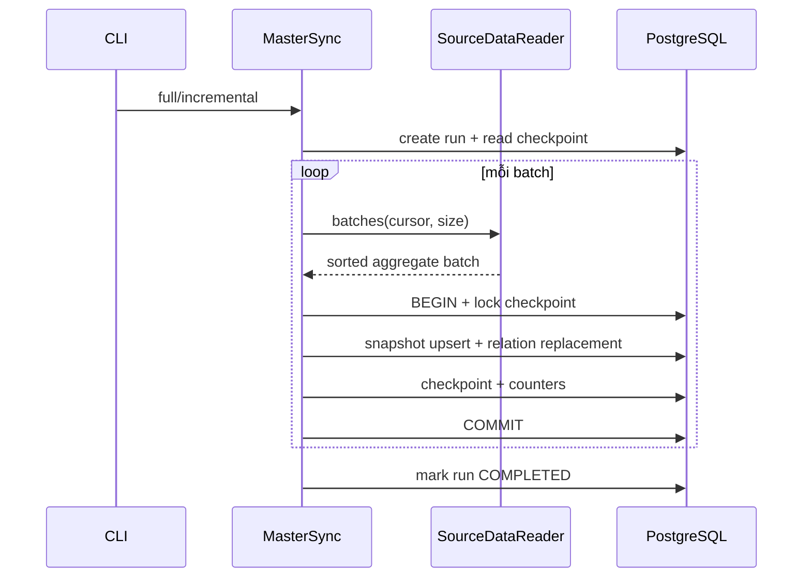

# Master Data Synchronization

Thứ tự `all`: grades → subjects → users → resources để đáp ứng FK.
Sync riêng resources giả định subjects/grades đã có ở master. Bốn stream có checkpoint độc lập.
So sánh tất cả field target; không UPDATE khi bằng nhau, không tạo updated_at giả.
Snapshot parent được map trong source adapter và truyền qua port; dữ liệu thật thay adapter không thay business.

Một batch là một transaction: khóa hàng checkpoint → upsert record → thay tập quan hệ → update checkpoint
và run counters → COMMIT. Vì vậy resource + hai loại quan hệ là atomic. Nếu một relation FK sai,
toàn bộ batch rollback. Batch trước đó đã commit vẫn còn, checkpoint không trỏ qua batch lỗi.
Checkpoint chỉ nhìn thấy sau commit; full sync không làm lùi checkpoint đã có.
Checkpoint được tạo bằng INSERT ON CONFLICT DO NOTHING trước khi khóa, kể cả hai sync khởi động đồng thời.

Quan hệ dùng composite PK. Chỉ delete tập relation của resource đang xử lý khi tập desired khác target;
không hard delete master. Provider/role/education trạng thái thay đổi nằm trong field snapshot riêng.
Các chỉ số inserted/updated/skipped đếm aggregate, không đếm từng relation.
Run thất bại giữ counters các batch đã commit và failed=1 (một batch lỗi).

Debug: xem `sync_runs` theo stream/run_id; kiểm tra references trong fixture và cursor trước/sau.
Log JSON chỉ ghi action/ID/duration/correlation, không dump DTO hoặc DB parameters.
Nếu run FAILED, sửa source rồi chạy `sync-master --stream ... --incremental`.
Nếu nguồn sửa dữ liệu nhưng quên tăng timestamp, chạy `--full` và sửa adapter nguồn.
